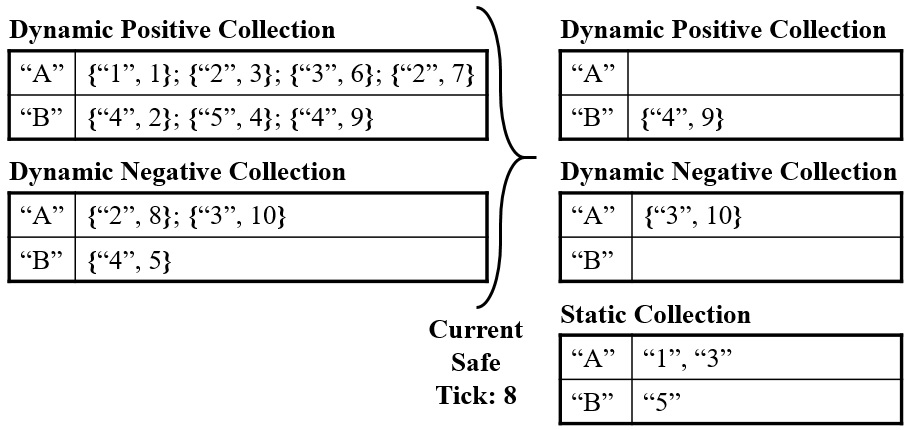
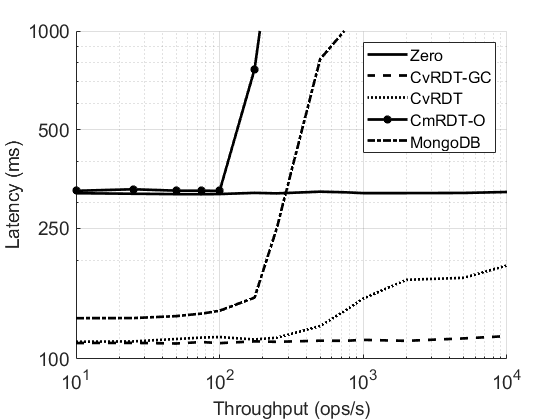
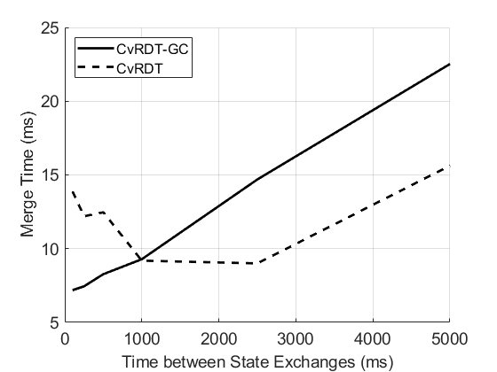
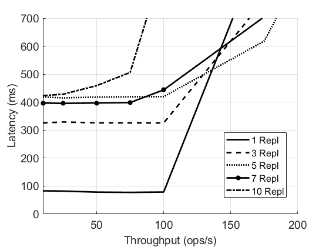

# Chevrotain: a CRDT-Based Replicated Key-Value Store
Chevrotain is a replicated multi-primary key value store that achieves eventual consistency through the use of conflict-free replicated data types (CRDTs). This project implements and evaluates performances of three different design approaches to the implementation of such a store. The three approaches are:
1. State-based CRDT model (CvRDT) with or without garbage collection
2. Operation-based CRDT model (CmRDT) without any synchronization
3. Operation-based CRDT model (CmRDT) with limited synchronization

Performance was evaluated by subjecting the three implementations to various loads while deployed on ten geographically distributed Azure VMs. Performance was also compared against MongoDB's built-in [replication service](https://docs.mongodb.com/manual/replication/) which follows the primary-backup model. The key points of the [full technical report (PDF)](docs/report/report.pdf) are summarized below.

This was an individual project completed in the fall of 2020 for the *Distributed Systems Abstractions* graduate course (CPSC 538B) at UBC. The insight and feedback received throughout this project from [Prof. Ivan Beschastnikh](https://www.cs.ubc.ca/~bestchai/) and ability to use Microsoft Azure Education credits is much appreciated.

**Main Golang Libraries:**
[net/rpc](https://golang.org/pkg/net/rpc/), 
[MongoDB](https://pkg.go.dev/go.mongodb.org/mongo-driver/mongo),
[BSON](https://pkg.go.dev/go.mongodb.org/mongo-driver/bson),
[GoVector](https://github.com/DistributedClocks/GoVector) \
**Other Libraries Used**:
[net/http](https://golang.org/pkg/net/http/), 
[net/html](https://pkg.go.dev/golang.org/x/net/html),
[encoding/csv](https://golang.org/pkg/encoding/csv/),
[os/signal](https://golang.org/pkg/os/signal/),
[windows](https://pkg.go.dev/golang.org/x/sys/windows)

---

Jump to [Background](#Background) | [Test Methodology](#Test-Methodology) 
| [Results for a 3-Replica System](#3-replica-system) | [Scalability Results](#scalability-results)

## API
All communication between the client and any one of the replicas is done via the RPCExt object. The following methods can be called on this object. The parameters passed to the `InitReplica` method are implementation dependent. For example, in the CvRDT implementation, the `timeInt` parameter sets the time intervals between state exchanges, while the `bias` parameter is a struct that sets the user-defined bias in case of simultaneous InsertKey\RemoveKey and InsertValue\RemoveValue calls. All communication between the replicas is done via the RPCInt object, and the APIs there are implementation dependent.
* `InitReplica(timeInt int, bias Bias)`
* `InsertKey(key string)`
* `InsertValue(key string, value string)`
* `RemoveKey(key string)`
* `RemoveValue(key string, value string)`
* `TerminateReplica()`

## Background
#### CvRDT

The implementation largely follows the approach described in section 3.3.3 of [this](https://hal.inria.fr/inria-00555588/document) paper by Marc Shapiro et. all. 

#### Figure 1: Garbage collection in CvRDT

#### CmRDT

The implementation largely follows the approach described in section 5 and figure 3 of [this](https://hal.inria.fr/inria-00609399v1/document) paper by Marc Shapiro et. all.

## Test Methodology
All implementations of the project were deployed on up to ten Azure D4s v3 VMs located in Canada Central, UK South, Japan East, Australia East and Brazil South zones. All implementations were subjected to a standard test that evenly distributed 1050 API calls between the given set of replicas. The rate at which the API calls were delivered to the replicas varied from 10 ops/s to 10 000 ops/s and resulting end-to-end latency, consistency and time to reach steady state (CvRDT only) were measured. In a separate experiment, MongoDB's built-in replication service was set-up between the same replicas and the primary replica was subjected to the same API calls.

## Results
### 3-Replica System
* CvRDT implementation with garbage collection (CvRDT-GC in the figure) performed best, maintaining latency of about 100ms under all loads.
* CvRDT implementation without garbage collection (CvRDT in the figure) performed second best, maintaining latency of about 100ms for throughput of up to 250 ops/s. Latency increased to about 200ms under a throughput of 10 000 ops/s.
* MongoDB's built-in replication service maintained latency less than 150ms for throughput of up to 100 ops/s. Latency increased to about 1s at throughput of 750 ops/s. Throughput saturated at 750 ops/s.
* CmRDT implementations performed worst, with CmRDT-O implementation demonstrating acceptable latency only for throughput less than or equal to 100 ops/s. Performance of the CmRDT-C implementation was even less notable.

#### Figure 2: Latency as a function of throughput for a 3-replica system

However, end-to-end latency measurements for CvRDT do not include time delays on the order of tens of seconds to exchange and merge states. Those delays are a function of the pre-set time interval that determines the frequency of state exchanges. At a throughput of 10 000 ops/s, delay decreases to 7s when state exchanges run every 100ms and increases to 22s when state exchanges run every 5000ms.

#### Figure 3: Merge time as a function of time between state exchanges in the CvRDT system

### Scalability Results
* CvRDT-GC implementation scaled to 10-replicas without any significant loss in performance.
* MongoDB's built-in replication service saturated at similar throughput thresholds (750 ops/s in a 5-replica system and 500 ops/s in 7 and 10-replica systems).
* CmRDT-O implementation demonstrated unacceptable latency at lower throughput thresholds (100 ops/s in a 5-replica system, 75 ops/s in a 7-replica system 50 ops/s in a 10-replica system)

#### Figure 4: Scalability of CvRDT-GC

#### Figure 5: Scalability of MongoDB's Built-in Replication

#### Figure 6: Scalability of CmRDT-O

## Additional Information
[Package Specific Information](docs/packages.md)
